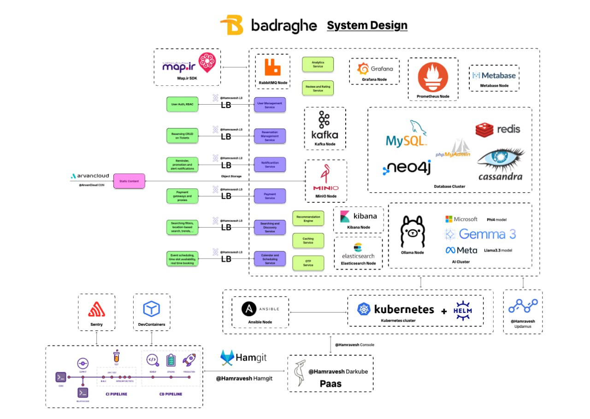
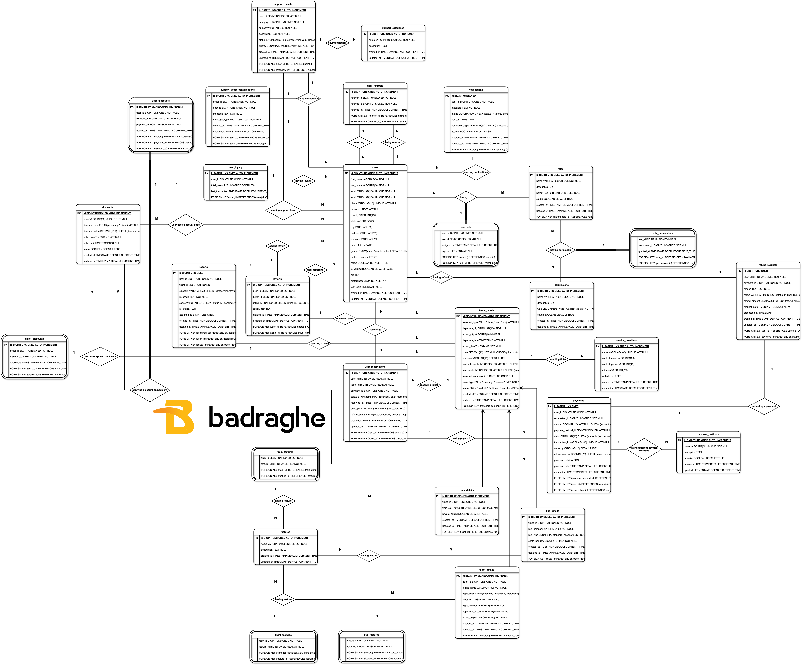
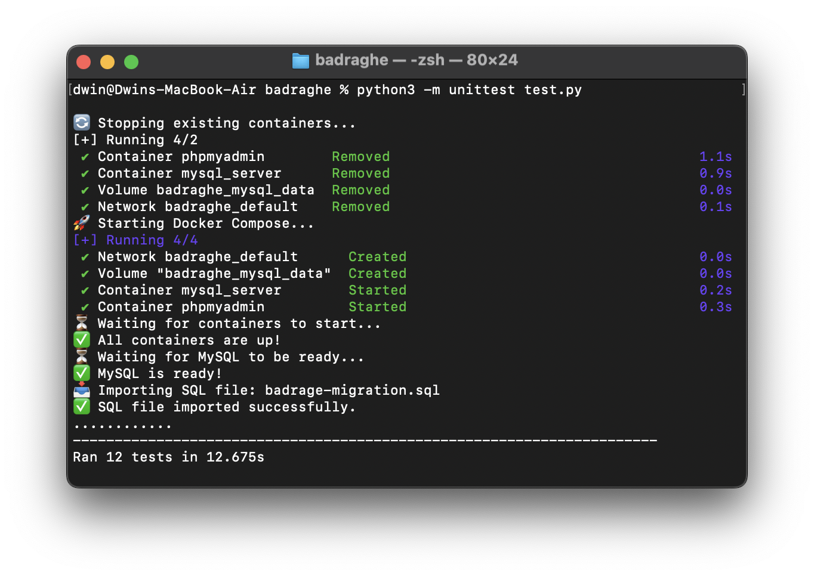
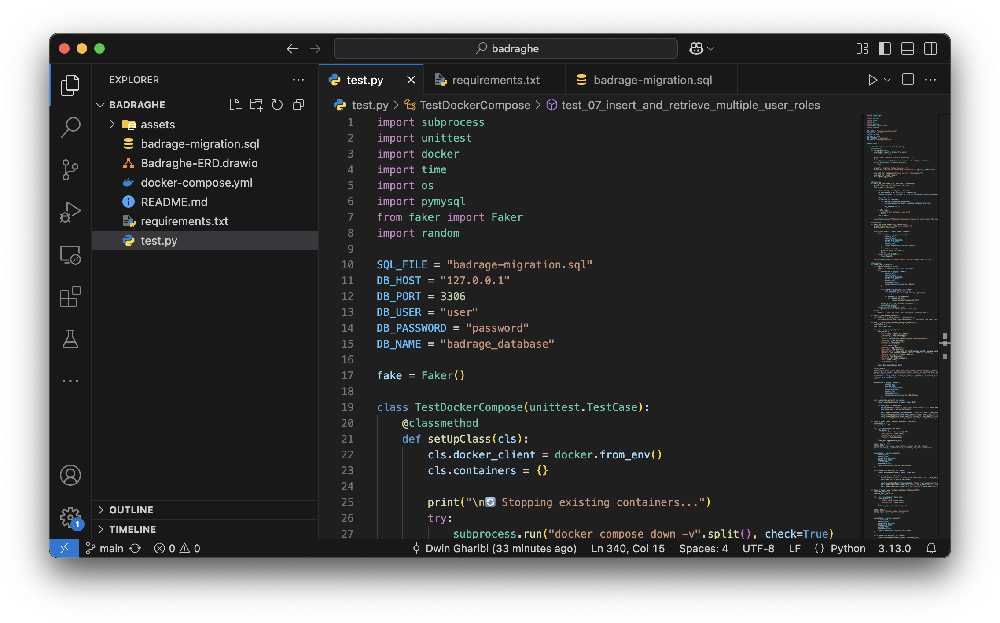
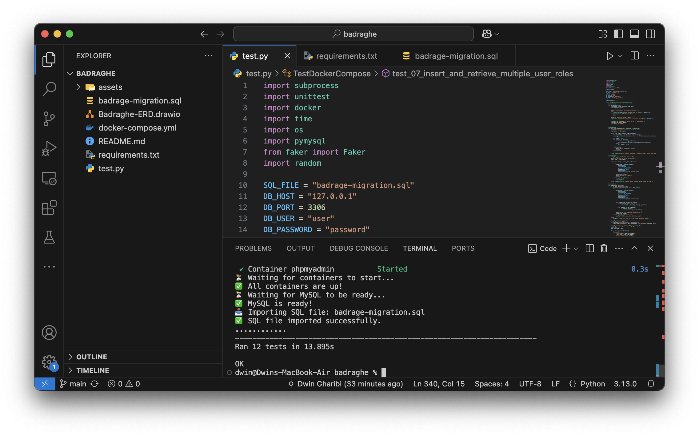
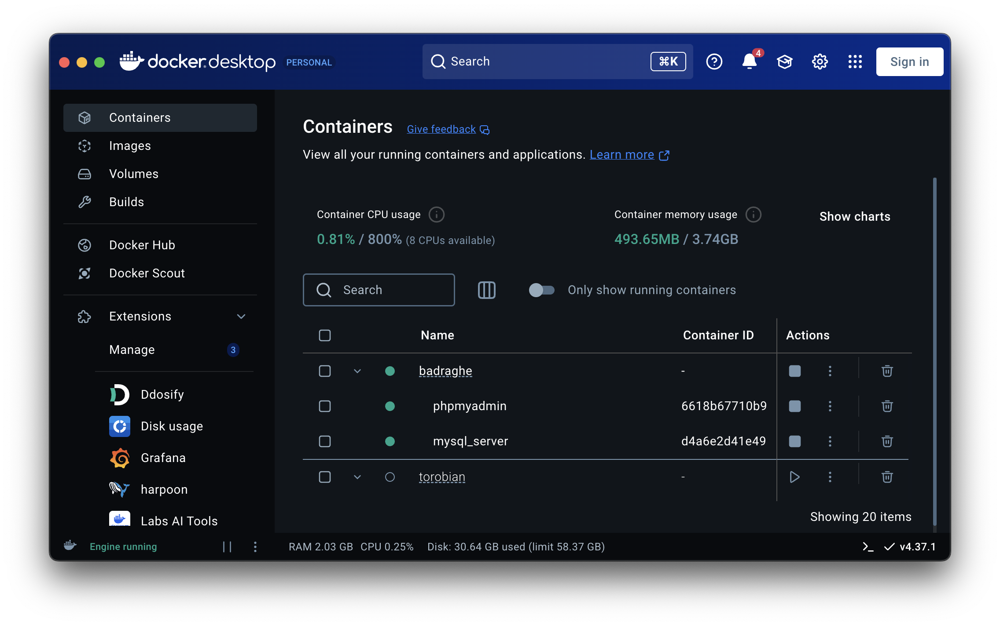
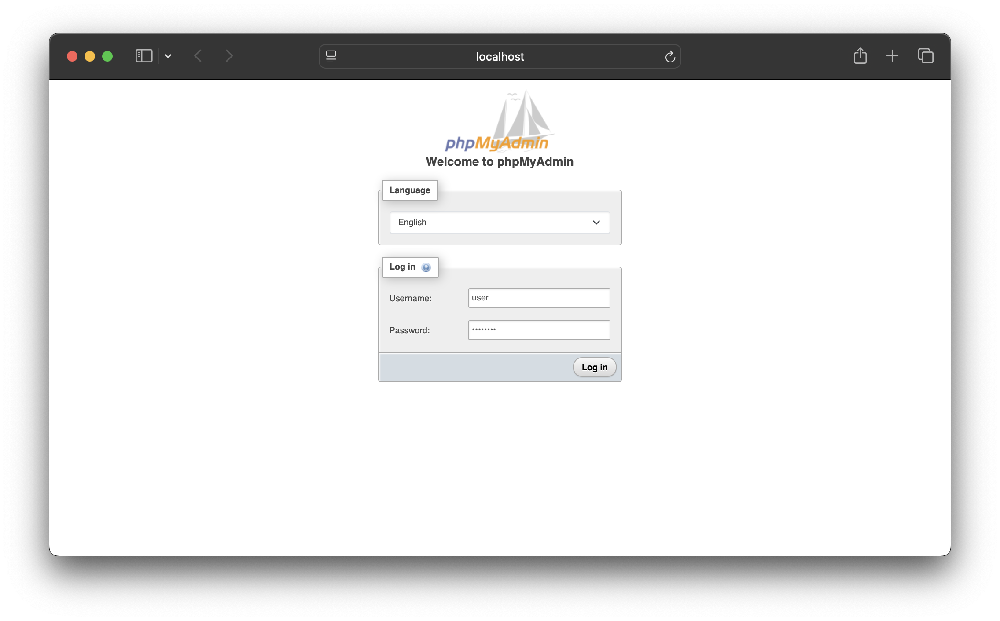
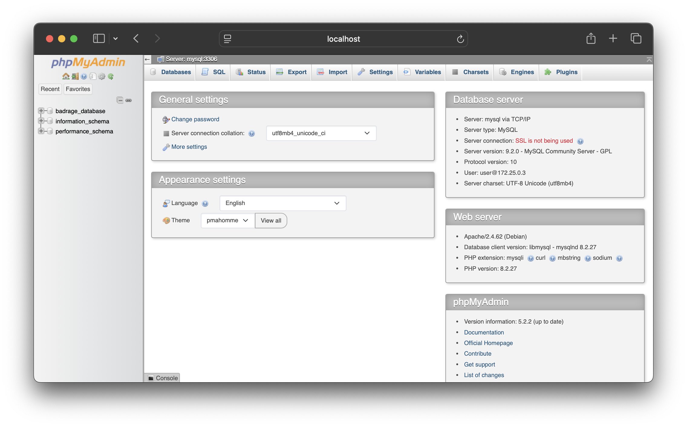
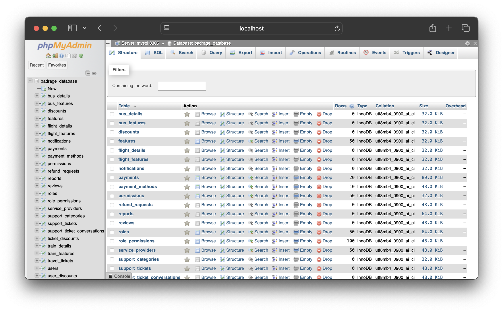
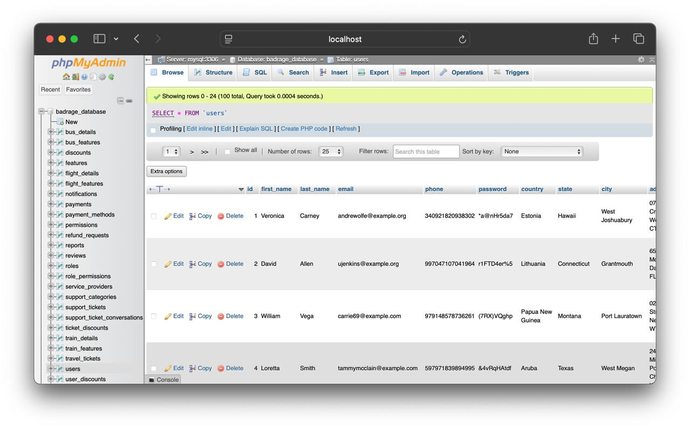

# Badraghe


**Badraghe** is a comprehensive online booking platform that allows users to search, reserve, and manage tickets seamlessly. Inspired by industry giants like Alibaba, it offers a real-time, secure, and flexible reservation system that adapts to users' needs.




## 🚀 Features

- **Real-Time Booking**: Ensures up-to-date availability and instant confirmations.
- **Secure Transactions**: Implements robust security protocols to protect user data and payments.
- **User-Friendly Interface**: Designed for intuitive navigation and ease of use.
- **Flexible Reservations**: Offers adaptable booking options to cater to diverse user requirements.

## 📋 ER Diagram



## 🪄 Usage and Tests

This project sets up a **MySQL** database using **Docker Compose** and provides a Python test suite *(test.py)* for validating database operations using unittest and pymysql.

## 📦 Prerequisites

Make sure you have the following installed:

- ✅ **Docker & Docker Compose → For running MySQL and phpMyAdmin**
- ✅ **Python (>=3.8) → For running test scripts**
- ✅ **pip → For installing dependencies**

You can both run **docker compose** manually or use the **python test script** to set up the test environment and add dummy data!

## 🚀 Setup & Usage
### 1️⃣ Start MySQL & phpMyAdmin using Docker (Optional)
Run the following command in the project directory:

```bash docker docker
docker-compose up -d
```
- This will start **MySQL** and **phpMyAdmin** in the background.
- **MySQL** will be accessible on port 3306.
- **phpMyAdmin** will be available at http://localhost:8080 *(Login using the credentials below).*

### 2️⃣ Access phpMyAdmin (Optional)

- **Go to:** http://localhost:8080
- Login Credentials:
    - **Server:** `mysql`
    - **Username:** `user`
    - **Password:** `password`

Before running the tests, apply the database schema using:

```bash docker docker
docker exec -i mysql_server mysql -uuser -ppassword badrage_database < badrage-migration.sql
```

**This will create all necessary tables.**

## 🔬 Running Tests using python script (test.py)
### 1️⃣ Install Python Dependencies

First, install required packages:

```bash terminal terminal
pip install -r requirements.txt
```

### 2️⃣ Run the Tests

**Execute the test suite:**

```bash terminal terminal
python -m unittest test.py
```









This will:

- **Insert mock data into the database**
- **Perform retrieval & validation checks**
- **Ensure constraints (e.g., unique emails, valid foreign keys) are enforced**







**The test script** generates realistic but dummy data using the *Faker library.* It creates random user details, travel tickets, reservations, and payments, mimicking real-world data.

Examples of generated data:
- ✅ **Users:** Names, emails, phone numbers, addresses
- ✅ **Travel Tickets:** Departure & arrival cities, times, prices, seat availability
- ✅ **Reservations & Payments:** Booking statuses, transaction IDs

This ensures the database is tested with realistic scenarios while avoiding duplicate or invalid data.

